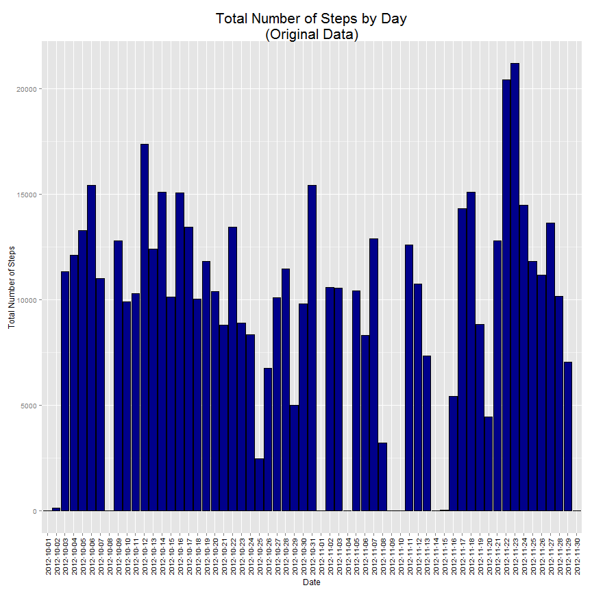
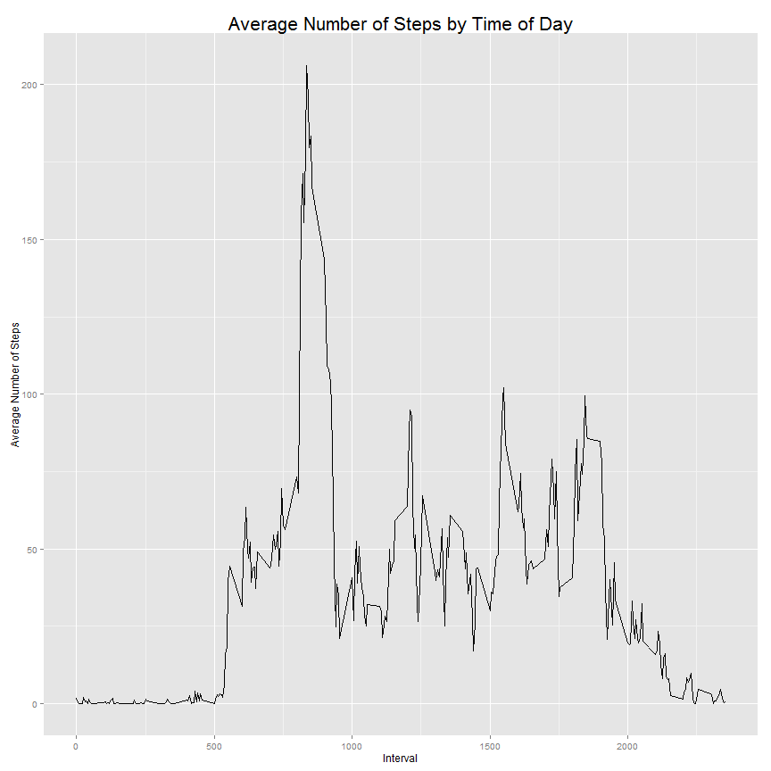
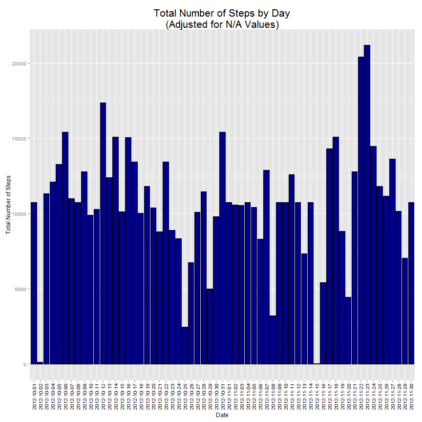
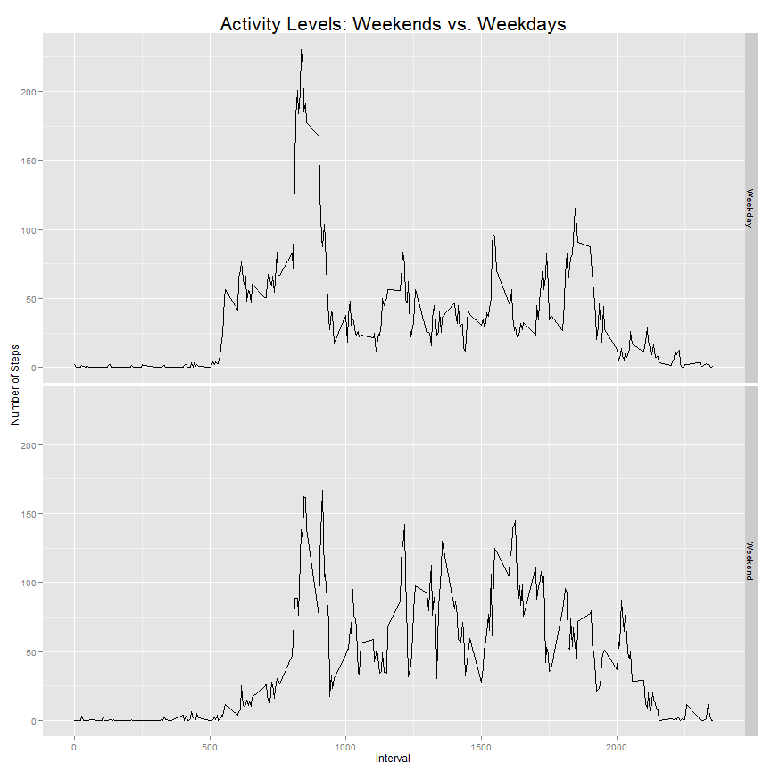

# Activity Monitoring Dataset Analysis

This is an analysis of the Activity Monitoring dataset provided by the Reproducible Research Coursera course offered by the John Hopkins Bloomberg Schools of Public Health. This dataset which was obtained from a personal device utilized by a single anonymous individual collected during the months of October and November of 2012. This data was collected at 5 minute intervals through out the day and includes the number of steps taken during each of these intervals. This analysis will look at the following four areas:

1. The mean total number of steps taken per day.
2. The average daily activity pattern.
3. The impact of missing values and the impact of controlling for these missing values.
4. The differences in activity patterns between weekdays and weekends.

## Part 1: Download the Data Set and Load into R

The first set of commands is to download the data file and load into the R programming environment. Also, two libraries are loaded which will be utilized throughout this analysis and the download date and session information are retained as well.

*Important* : Before running any code, please be sure to set up to the intended working directory. Since the directory naming conventions differ across operating systems, this step should be run beforehand.


```r
file.link = 
    c("http://d396qusza40orc.cloudfront.net/repdata%2Fdata%2Factivity.zip") ;
download.file( file.link, destfile = "ActivityMonitoringData.zip" )
download.date <- date()

library(ggplot2)   # Used for the ggplot plotting
library(plyr)      # Required for the ddply() function
options("scipen" = 100, "digits" = 2) # Option set to avoid printing some of
                    # of the output figures using exponential notation
download.session.info <- sessionInfo()

unzip("ActivityMonitoringData.zip")
activity = read.csv("activity.csv")
```

## Part 2: Analysis of Total Steps Taken By Day

The initial review of this data centers around the total number of steps taken for each day which is displayed in a histogram plot and the average and median values of the number of steps taken  


```r
# Summarize the number of steps by total, average, and median value for each
# day utilizing ddply() and storing it in the dailysteps variable.

dailysteps = ddply(activity, .(date), summarize, 
                   totalsteps = sum(steps, na.rm = TRUE),
                   meansteps = mean(steps, na.rm = TRUE),
                   mediansteps = median(steps, na.rm = TRUE))

# Create a histogram plot of the total steps by day using ggplot()

ggplot(dailysteps, aes( x = date, y = totalsteps)) + 
    geom_bar(stat = "identity", fill = "darkblue", colour = "black") + 
    xlab("Date") + 
    ylab("Total Number of Steps") + 
    ggtitle("Total Number of Steps by Day\n(Original Data)") +
    theme(plot.title = element_text(size = rel(1.75))) +
    theme(axis.text.x = element_text(angle = 90, hjust = 1, vjust = .5,
                                     color = "black", size = rel(1)))
```

 

```r
# Report the total, mean, and median values by day in a table. The column names
# of the dailysteps variable are modified to make the table look presentable.

dailysteps.mean = mean( dailysteps$totalsteps, na.rm = TRUE )
dailysteps.median = median( dailysteps$totalsteps, na.rm = TRUE )
```

The **average (mean) number of steps taken each day is ``9354.23``** and **the median number of steps taken each day is ``10395``.**

## Part 3: Average Daily Activity Pattern

Next, the activity across the time of day is reviewed with the creation of the a line graph depicting the average activity across time of day and the calculation of the daily interval with the largest average number of steps.


```r
intervalsteps = ddply(activity, .(interval), summarize, 
                   meansteps = mean(steps, na.rm = TRUE))

ggplot( intervalsteps, aes(x=interval, y=meansteps)) + geom_line() +
    xlab( "Interval") + 
    ylab( "Average Number of Steps") +
    ggtitle( "Average Number of Steps by Time of Day") + 
    theme(plot.title = element_text(size = rel(1.75)))
```

 

```r
intervalmax = intervalsteps$interval[which.max(intervalsteps$meansteps)]        
```

**The interval with the maximum number of steps (on average across all the days in the dataset) is interval #``835``.**

## Part 4: Imputing Missing Values

This section will review the dataset to determine if there are any missing values and will do so in a two step process:

1. The date and interval elements will be reviewed to determine if there are any missing values. If there are, they will be removed from the dataset as there is no logical methodology to assigning these values to a specific date or interval without discussing this with the original providers of the dataset. Note: there is not expected to be any missing values for this category.

2. If there are any missing values for the steps, then those values will be replaced with the average number of steps for that interval across all days will measured values.


```r
dates.mv = sum(is.na(activity$date))
intervals.mv = sum(is.na(activity$interval))

# Check if any date values are missing and, if so, remove the records
if ( dates.mv > 0 ) { activity = activity[!is.na(activity$date)]}
# Check if any interval values are missing and, if so, remove the records
if ( intervals.mv > 0 ) { activity = activity[!is.na(activity$interval)]}

steps.mv = sum(is.na(activity$steps))

activity.count = length( activity$steps )

# Replace all NA values for the steps element with the average for that interval
for ( i in 1:activity.count ) {
      if (is.na(activity$steps[i])) {
           row.index = ( intervalsteps$interval == activity$interval[i] );
           activity$steps[i] = 
               intervalsteps[ row.index, ]$meansteps;
           }
     }


# Rerun the functions for the analyis of total steps

dailysteps.revised = ddply(activity, .(date), summarize, 
                   totalsteps = sum(steps, na.rm = TRUE))

ggplot(dailysteps.revised, aes( x = date, y = totalsteps)) + 
    geom_bar(stat = "identity", fill = "darkblue", colour = "black") + 
    xlab("Date") + 
    ylab("Total Number of Steps") + 
    ggtitle("Total Number of Steps by Day\n(Adjusted for N/A Values)") +
    theme(plot.title = element_text(size = rel(1.75))) +
    theme(axis.text.x = element_text(angle = 90, hjust = 1, vjust = .5,
                                     color = "black", size = rel(1)))
```

 

```r
dailysteps.revised.mean = mean( dailysteps.revised$totalsteps, na.rm = TRUE )
dailysteps.revised.median = median( dailysteps.revised$totalsteps, na.rm = TRUE)
```

With the adjustments made for the NA values in the data set, the new mean and median values are as follows:

- The new average value for the number of steps per day is ``10766.19`` as compared to ``9354.23`` before the adjustments were made.
- The new median value for the number of steps per day is ``10766.19`` as compared to ``10395`` before the adjustments were made.

Due to the methodology used for replacing NA values, it is not surprising that the mean and median values are equal as many of the NA values are across the same day. For those days which have no values during any of that day's intervals, then the average and median would simply be the average value across all days.

The new plot indicates that there are still a couple of days where there is a low number of steps being made. Closer examination of the dataset indicated that, for these days, many of records had a recorded value of zero and not NA. These days appear as outliers and are grounds for further investigation directly with the subject. Since it is possible that the subject did take a minimal number of steps due to perhaps illness or hospitilization, it is not appropriate to presume these values are missing and, hence, are not being adjusted.


## Part 5: Differences in Activity Patterns Between Weekdays and Weekends

The final section looks at the differences in activity level, as measured by the number of steps, between days occuring on the weekend as opposed to the normal working week. Two line graphs are presented to illustrate the differences.


```r
activity$day = weekdays( as.Date(activity$date, "%Y-%m-%d") )

weekend.values = c("Saturday", "Sunday")
weekend.flag = activity$day %in% weekend.values
activity$day[ weekend.flag ] = "Weekend"
activity$day[ !(weekend.flag) ] = "Weekday"
activity$day = as.factor(activity$day)

stepsbyday = ddply(activity, .(day, interval), summarize, 
                   meansteps = mean(steps, na.rm = TRUE))

ggplot( stepsbyday, aes(x=interval, y=meansteps)) + geom_line() +
    facet_grid(day ~ .) + ylab("Number of Steps") +
    xlab("Interval") +
    ggtitle("Activity Levels: Weekends vs. Weekdays") + 
    theme(plot.title = element_text(size = rel(1.75)))
```

 

This graph indicates the, during the weekends, the subject had less activity during the 8:00 to 8:45 intervals but more activity from the 10 AM to 2 PM timeframe. 
